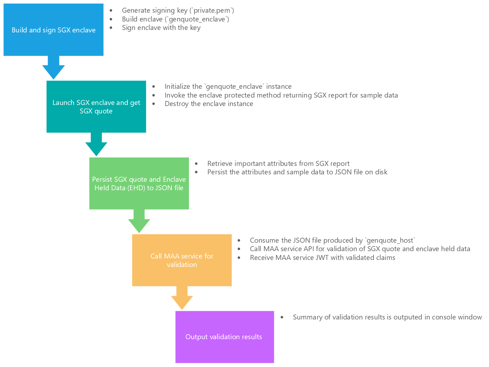

## Sample code for Intel® SGX Attestation using Microsoft Azure Attestation and Intel(R) SGX DCAP for Linux* OS

### References and Credits
* The sample, including code, design and documentation, is derived from the [MAA SGX Attestation Sample Code Using Open Enclave SDK](https://github.com/Azure-Samples/microsoft-azure-attestation/tree/master/sgx.attest.sample) and follows its execution flow
* The SGX enclave and host code in this sample is derived from the [Intel(R) Software Guard Extensions Data Center Attestation Primitives (Intel(R) SGX DCAP) Quote Generation SampleCode](https://github.com/intel/SGXDataCenterAttestationPrimitives/tree/master/SampleCode/QuoteGenerationSample)
* Intel(R) Software Guard Extensions (Intel(R) SGX) Data Center Attestation Primitives (Intel(R) SGX DCAP): https://github.com/intel/SGXDataCenterAttestationPrimitives
* Intel(R) Software Guard Extensions for Linux* OS: https://github.com/intel/linux-sgx

### Overview

The MAA SGX Attestation sample code demonstrates how to generate a quote in an SGX enclave and then get it validated by the MAA service. The "enclave held data" for the quote for simplicity is populated with sample data represented as `uint8_t` array.

The execution flow in the sample code are outlined in the following diagram:


The flow is:
1. ```genquote_enclave``` - This application is an SGX enclave created via the Intel® SGX SDK. It exposes one ECALL to retrieve a remote quote for enclave held data.
    1. Generate signing key (`private.pem`)
    1. Build enclave (`genquote_enclave`)
    1. Sign enclave with the key
1. ```genquote_host``` - This application is run first and performs the following:
    1. Initializes and launches the `genquote_enclave` SGX enclave instance
    1. Invokes the enclave protected method (ECALL) to retrieve a remote quote for hashed (SHA256) enclave held data, which in this case is a `uint8_t` static array
    1. Retrieves important attributes from the SGX report, such as Security Version Number, ProductID, MRSIGNER, MRENCLAVE, etc.
    1. Persists the remote quote, enclave held data and parsed report fields to a JSON file on disk
1. ```validatequotes.core``` - This application is built on .NET core and runs on any platform. It consumes the JSON file persisted by the ```genquote_host``` application and performs the following:
    1. Calls the MAA service for validation, passing it the remote quote and enclave held data found in the JSON file
    1. Validates that the MAA JWT passes signature validation and is issued by the expected party
    1. Validates that the MAA JWT claim values match the parsed data in the JSON file for the well known fields like Security Version Number, ProductID, MRSIGNER, MRENCLAVE, etc.
    1. Produces a report in the console with the results

### Quote Generation

Remote quote generation is performed by the following call to the ```sgx_create_report``` method in the [ecall.cpp](./genquotes/enclave/ecall.cpp) file in the ```genquote_enclave``` application.

```
sgx_status_t sgx_create_report(
    const sgx_target_info_t *target_info,
    const sgx_report_data_t *report_data,
    sgx_report_t *report
);

```

### Remote Quote Validation via MAA Attestation

The MAA service is called to perform attestation by the following call in the [MaaService.cs](./validatequotes.core/MaaService.cs#L32) file:

```
    // Send request
    var response = await theHttpClient.SendAsync(request);
```

The verification that the MAA service JWT passes signature validation and is issued by the expected issuer is in the [JwtHelperValidation.cs](./validatequotes.core/Helpers/JwtValidationHelper.cs#L22) file:
```
    public static TokenValidationResult ValidateMaaJwt(string attestDnsName, string serviceJwt)
```

The verification that the MAA service JWT claims match the initial parsed report data is performed in the [EnclaveInfo.cs](./validatequotes.core/EnclaveInfo.cs#L31) file:
```
    public void CompareToMaaServiceJwtToken(string serviceJwtToken, bool includeDetails)
```

### Instructions to Build and Run

#### Prerequisites

* Azure Confidential Computing VM with Ubuntu 18.04


## How to Build and Run

Based on [Greg's Instructions to Build and Run Yourself](https://github.com/gkostal/attestation/tree/master/sgx.attest.sample#instructions-to-build-and-run-yourself) with minor additions. 

### Create an Azure Confidential Computing VM with Ubuntu 18.04
* Log into https://portal.azure.com with personal or corporate account.
  * If you use a corporate account, confirm with the team that they have quota for ACC VM.
  * Find or create a dedicated resource group.
  * Add new resource "Azure Confidential Computing (Virtual Machine)"
    * It is recommended (by Azure) to use SSH keys for remote access to ACC VMs. See [How to use SSH keys with Windows on Azure](https://docs.microsoft.com/en-us/azure/virtual-machines/linux/ssh-from-windows) for more info.
    * Create SSH key: `ssh-keygen -m PEM -t rsa -b 4096`. Select filename and pass-phrase if needed.
    * Copy public key (`cat ~/.ssh/id_rsa.pub` and copy) and paste it into the new VM settings.
    * Use the following command line to connect to the new VM: `ssh -i ~/.ssh/id_rsa.pub azureuser@10.111.12.123`.
### Set-up ACC VM
* Connect to(`ssh -i ~/.ssh/id_rsa.pub azureuser@10.111.12.123`, for example `$ ssh -i ~/.ssh/id_rsa olkroshk@52.151.75.77`) and install prerequisites (source: [Install the Open Enclave SDK (Ubuntu 18.04)](https://github.com/openenclave/openenclave/blob/v0.9.x/docs/GettingStartedDocs/install_oe_sdk-Ubuntu_18.04.md)).
* (Optional) use a terminal multiplexer for work sessions with Linux VMs, such as tmux. I.e run `tmux`.
##### 1. Configure the Intel and Microsoft APT Repositories
```
echo 'deb [arch=amd64] https://download.01.org/intel-sgx/sgx_repo/ubuntu bionic main' | sudo tee /etc/apt/sources.list.d/intel-sgx.list
wget -qO - https://download.01.org/intel-sgx/sgx_repo/ubuntu/intel-sgx-deb.key | sudo apt-key add -

echo "deb http://apt.llvm.org/bionic/ llvm-toolchain-bionic-7 main" | sudo tee /etc/apt/sources.list.d/llvm-toolchain-bionic-7.list
wget -qO - https://apt.llvm.org/llvm-snapshot.gpg.key | sudo apt-key add -

echo "deb [arch=amd64] https://packages.microsoft.com/ubuntu/18.04/prod bionic main" | sudo tee /etc/apt/sources.list.d/msprod.list
wget -qO - https://packages.microsoft.com/keys/microsoft.asc | sudo apt-key add -
```
##### 2. Install the Intel SGX DCAP Driver
```
sudo apt update
sudo apt -y install dkms
wget https://download.01.org/intel-sgx/sgx-dcap/1.4/linux/distro/ubuntuServer18.04/sgx_linux_x64_driver_1.21.bin -O sgx_linux_x64_driver.bin
chmod +x sgx_linux_x64_driver.bin
sudo ./sgx_linux_x64_driver.bin
```
##### 3. Install the Intel and Open Enclave packages and dependencies
```
sudo apt -y install clang-7 libssl-dev gdb libsgx-enclave-common libsgx-enclave-common-dev libprotobuf10 libsgx-dcap-ql libsgx-dcap-ql-dev az-dcap-client open-enclave=0.9.0
```
Note: as of 2020/08/12 SGX sample requires 0.9.0 version of open-enclave, even though there is 0.10.0 version available. The command above specifies which version of open-enclave needs to be installed (`open-enclave=0.9.0`).  
##### 4. Configure environment variables for Open Enclave SDK for Linux
See [Configure environment variables for Open Enclave SDK for Linux](https://github.com/openenclave/openenclave/blob/v0.9.x/docs/GettingStartedDocs/Linux_using_oe_sdk.md#configure-environment-variables-for-open-enclave-sdk-for-linux) for more details.
```
echo "source /opt/openenclave/share/openenclave/openenclaverc" >> ~/.bashrc
source ~/.bashrc
```
##### 5. (Optional) Stub AZDCAP_DEBUG_LOG_LEVEL
```
export AZDCAP_DEBUG_LOG_LEVEL='NONE'
```
Notice that `NONE` log level is not supported (see ["What is?"](https://github.com/olkroshk/stuff/blob/master/clutter/work-items/ignite-sgx-sample.md#azdcap_debug_log_level) section below), it is used here to stub the environment variable with something other than `INFO`, `WARNING`, or `ERROR`.
If the variable is unset, errors similar to `Azure Quote Provider: libdcap_quoteprov.so [ERROR]: Could not retreive environment variable for 'AZDCAP_DEBUG_LOG_LEVEL'
` are expected later on.

To unset `AZDCAP_DEBUG_LOG_LEVEL` run:
```
unset AZDCAP_DEBUG_LOG_LEVEL
```
### Build and Run 
##### 1. Get code and build
```
export WORK_DIR=$(pwd)
echo $WORK_DIR
git clone https://github.com/gkostal/attestation.git
cd attestation/sgx.attest.sample/genquotes
make build
```
##### 2. Run Enclave Application
```
make run
```
This runs the application in four different enclave configurations to generate four different remote quotes. 
You should see four new files created in the `$WORK_DIR/attestation/sgx.attest.sample/genquotes/quotes` directory.

Example of expected terminal output:
```
host/genquote_host ./enclave/genquote_enclave.debug.signed              enclave.info.debug.json
    JSON file created: enclave.info.debug.json
host/genquote_host ./enclave/genquote_enclave.release.signed            enclave.info.release.json
    JSON file created: enclave.info.release.json
host/genquote_host ./enclave/genquote_enclave.prodid.signed             enclave.info.prodid.json
    JSON file created: enclave.info.prodid.json
host/genquote_host ./enclave/genquote_enclave.securityversion.signed    enclave.info.securityversion.json
    JSON file created: enclave.info.securityversion.json
```

Example of expected output files:
```
cd $WORK_DIR/attestation/sgx.attest.sample/genquotes/quotes
ls -la ./
-rw-rw-r-- 1 olkroshk olkroshk 10546 Aug 12 21:58 enclave.info.debug.json
-rw-rw-r-- 1 olkroshk olkroshk 10546 Aug 12 21:59 enclave.info.prodid.json
-rw-rw-r-- 1 olkroshk olkroshk 10546 Aug 12 21:59 enclave.info.release.json
-rw-rw-r-- 1 olkroshk olkroshk 10549 Aug 12 21:59 enclave.info.securityversion.json
```
##### 3. Build, run and validate the JSON files with the MAA service
```
cd $WORK_DIR/attestation/sgx.attest.sample/validatequotes.core
./runall.sh
```
'runall.sh' script builds and runs the validation application against the four different JSON files produced earlier.

Example of `runall.sh` terminal output:
```
[22:09:00.413] : ************************************************************************************************************************
[22:09:00.413] : *      VALIDATING MAA JWT TOKEN - MATCHES CLIENT ENCLAVE INFO
[22:09:00.413] : ************************************************************************************************************************
[22:09:00.413] :
[22:09:00.416] : IsDebuggable match                 : True
[22:09:00.416] :     We think   : False
[22:09:00.416] :     MAA service: False
[22:09:00.416] : MRENCLAVE match                    : True
[22:09:00.416] :     We think   : b34abc63333326b626740f0fe66e543eb946847f6b5b4efa19126efe0c20c69b
[22:09:00.416] :     MAA service: b34abc63333326b626740f0fe66e543eb946847f6b5b4efa19126efe0c20c69b
[22:09:00.416] : MRSIGNER match                     : True
[22:09:00.416] :     We think   : 434aa827e97f4b4048cb885d079b153771278494c895c02ae4283897a472e41f
[22:09:00.416] :     MAA service: 434aa827e97f4b4048cb885d079b153771278494c895c02ae4283897a472e41f
[22:09:00.417] : ProductID match                    : True
[22:09:00.417] :     We think   : 1
[22:09:00.417] :     MAA service: 1
[22:09:00.417] : Security Version match             : True
[22:09:00.417] :     We think   : 8888
[22:09:00.417] :     MAA service: 8888
[22:09:00.417] : Enclave Held Data match            : True
[22:09:00.417] :     We think   : LS0tLS1CRUdJTiBQVUJMSUMgS0VZLS0tLS0KTUlJQklqQU5CZ2txaGtpRzl3MEJBUUVGQUFPQ0FROEFNSUlCQ2dLQ0FRRUExSXZY
[22:09:00.417] :                  bEhwQ24xM0F6MWI1YVZVbApGL2dWTExxQUR3eHcwc0pMam5wVVJ5dXBGK0V6MmJYT1cvd1RLOHRwWm5LNWxqQWs4aC9seHY3NUY0
[22:09:00.417] :                  cG9KeG9rCjdOWFFWRU9LZDBwdzhHWVd3QkNLRjVqNk9ERnFCakZJdUY1UWNIQUpQaHF1bEJrNjhTazkxcmJJTDQyd0I4akgKR0pD
[22:09:00.417] :                  dTljbjRJeVJpb2ZFb2NaWkJRdDJKeFlyenNjUWZFSWE4cEluYmxIeXJIbk1BTWJ1aWVHYkVNcHFjcUVGSwpUTmxsaXNyeTFhN0Nu
[22:09:00.417] :                  RjcrSHZUeTJOcDhQd0hkOE9nbmkxNWZON2FRWDd3Qm9yN1dqM0FoNVNWNkJEY0VwK0ttCm9ZNThqWjE4UVU2eCtHUGVFT2I1emdm
[22:09:00.418] :                  MTJGKzhYN0V2Y3IvNDdKR2MydjBSR0lQa24vUUVwUWR0YnZQa2lkOVQKR3dJREFRQUIKLS0tLS1FTkQgUFVCTElDIEtFWS0tLS0t
[22:09:00.418] :                  CgAAAAAAAAAAAAAAAAAAAAAAAAAAAAAAAAAAAAAAAAAAAAAAAAAAAAAAAAAAAAAAAAAAAAAAAAAAAAAAAAA
[22:09:00.418] :     MAA service: LS0tLS1CRUdJTiBQVUJMSUMgS0VZLS0tLS0KTUlJQklqQU5CZ2txaGtpRzl3MEJBUUVGQUFPQ0FROEFNSUlCQ2dLQ0FRRUExSXZY
[22:09:00.418] :                  bEhwQ24xM0F6MWI1YVZVbApGL2dWTExxQUR3eHcwc0pMam5wVVJ5dXBGK0V6MmJYT1cvd1RLOHRwWm5LNWxqQWs4aC9seHY3NUY0
[22:09:00.418] :                  cG9KeG9rCjdOWFFWRU9LZDBwdzhHWVd3QkNLRjVqNk9ERnFCakZJdUY1UWNIQUpQaHF1bEJrNjhTazkxcmJJTDQyd0I4akgKR0pD
[22:09:00.418] :                  dTljbjRJeVJpb2ZFb2NaWkJRdDJKeFlyenNjUWZFSWE4cEluYmxIeXJIbk1BTWJ1aWVHYkVNcHFjcUVGSwpUTmxsaXNyeTFhN0Nu
[22:09:00.418] :                  RjcrSHZUeTJOcDhQd0hkOE9nbmkxNWZON2FRWDd3Qm9yN1dqM0FoNVNWNkJEY0VwK0ttCm9ZNThqWjE4UVU2eCtHUGVFT2I1emdm
[22:09:00.418] :                  MTJGKzhYN0V2Y3IvNDdKR2MydjBSR0lQa24vUUVwUWR0YnZQa2lkOVQKR3dJREFRQUIKLS0tLS1FTkQgUFVCTElDIEtFWS0tLS0t
[22:09:00.418] :                  CgAAAAAAAAAAAAAAAAAAAAAAAAAAAAAAAAAAAAAAAAAAAAAAAAAAAAAAAAAAAAAAAAAAAAAAAAAAAAAAAAA
[22:09:00.418] :
[22:09:00.418] :
[22:09:00.418] :
[22:09:00.418] :
```


To set up the pre-requisites to build and run these samples:
1. Install Ubuntu 18.04 on an [Azure Confidential Compute](https://azure.microsoft.com/en-us/solutions/confidential-compute/) VM.
1. Install the [Open Enclave SDK](https://github.com/openenclave/openenclave/blob/v0.9.x/docs/GettingStartedDocs/install_oe_sdk-Ubuntu_18.04.md) on this VM.  You don't need to install Ninja or CMake -- they are not used here.
1. Add the command "```. /opt/openenclave/share/openenclave/openenclaverc```" to your ~/.bashrc file.
1. Install the [.NET CORE SDK](https://docs.microsoft.com/en-us/dotnet/core/install/linux-package-manager-ubuntu-1804) on this VM.

To build and run the samples:
1. ```git clone``` this repo to the VM
1. ```cd``` to the subdirectory containing this sample code
1. To build, run and generate the JSON files do the following:
    1. ```cd genquotes```
    1. ```make build```
    1. ```make run```
    1. This runs the application in four different enclave configurations to generate four different remote quotes.  You should see four new files created in the ```../quotes``` directory.
1. To build, run and validate the JSON files with the MAA service do the following:
    1. ```cd validatequotes.core```
    1. ```./runall.sh```
    1. This builds and runs the validation application against the four different JSON files produced earlier.
    1. The runall.sh script assumes you have access to the tradewinds.us.test.attest.azure.net attestation provider.  If you don't, edit the [runall.sh](./validatequotes.core/runall.sh#L5) script to reference your attestation provider.  

The four different JSON files are:
* *enclave.info.debug.json* - debugging enabled
* *enclave.info.release.json* - debugging disabled
* *enclave.info.securityversion.json* - security version set to 999
* *enclave.info.prodid.json* - product id set to 999

## Example Output for make run
Here is an example of what the output of ```make run``` should look like:

```
greg@acc-ubuntu-1:~/src/aas/openenclave/maa-samples/genquotes$ make run
host/genquote_host ./enclave/genquote_enclave.debug.signed              enclave.info.debug.json
    JSON file created: enclave.info.debug.json
host/genquote_host ./enclave/genquote_enclave.release.signed            enclave.info.release.json
    JSON file created: enclave.info.release.json
host/genquote_host ./enclave/genquote_enclave.prodid.signed             enclave.info.prodid.json
    JSON file created: enclave.info.prodid.json
host/genquote_host ./enclave/genquote_enclave.securityversion.signed    enclave.info.securityversion.json
    JSON file created: enclave.info.securityversion.json
```

## Example Output for ./runall.sh
Here is an example of what the output of ```./runall.sh``` should look like:

```
greg@acc-ubuntu-1:~/src/attestation/sgx.attest.sample/validatequotes$ ./runall.sh 
05/04/2020 12:32:28 : 
05/04/2020 12:32:28 : Validating file '../genquotes/quotes/enclave.info.debug.json' against attestation provider 'tradewinds.us.test.attest.azure.net' with include details 'False'
05/04/2020 12:32:28 : 
05/04/2020 12:32:31 : JWT JKU location validation:        True
05/04/2020 12:32:32 : JWT signature validation:           True
05/04/2020 12:32:32 : JWT issuer claim validation:        True
05/04/2020 12:32:32 : JWT signing cert issuer validation: True
05/04/2020 12:32:32 : IsDebuggable check:                 True
05/04/2020 12:32:32 : MRENCLAVE check:                    True
05/04/2020 12:32:32 : MRSIGNER check:                     True
05/04/2020 12:32:32 : ProductID check:                    True
05/04/2020 12:32:32 : Security Version check:             True
05/04/2020 12:32:32 : Enclave Held Data check:            True
05/04/2020 12:32:32 : 
05/04/2020 12:32:33 : 
05/04/2020 12:32:33 : Validating file '../genquotes/quotes/enclave.info.release.json' against attestation provider 'tradewinds.us.test.attest.azure.net' with include details 'False'
05/04/2020 12:32:33 : 
05/04/2020 12:32:36 : JWT JKU location validation:        True
05/04/2020 12:32:37 : JWT signature validation:           True
05/04/2020 12:32:37 : JWT issuer claim validation:        True
05/04/2020 12:32:37 : JWT signing cert issuer validation: True
05/04/2020 12:32:37 : IsDebuggable check:                 True
05/04/2020 12:32:37 : MRENCLAVE check:                    True
05/04/2020 12:32:37 : MRSIGNER check:                     True
05/04/2020 12:32:37 : ProductID check:                    True
05/04/2020 12:32:37 : Security Version check:             True
05/04/2020 12:32:37 : Enclave Held Data check:            True
05/04/2020 12:32:37 : 
05/04/2020 12:32:38 : 
05/04/2020 12:32:38 : Validating file '../genquotes/quotes/enclave.info.prodid.json' against attestation provider 'tradewinds.us.test.attest.azure.net' with include details 'False'
05/04/2020 12:32:38 : 
05/04/2020 12:32:40 : JWT JKU location validation:        True
05/04/2020 12:32:42 : JWT signature validation:           True
05/04/2020 12:32:42 : JWT issuer claim validation:        True
05/04/2020 12:32:42 : JWT signing cert issuer validation: True
05/04/2020 12:32:42 : IsDebuggable check:                 True
05/04/2020 12:32:42 : MRENCLAVE check:                    True
05/04/2020 12:32:42 : MRSIGNER check:                     True
05/04/2020 12:32:42 : ProductID check:                    True
05/04/2020 12:32:42 : Security Version check:             True
05/04/2020 12:32:42 : Enclave Held Data check:            True
05/04/2020 12:32:42 : 
05/04/2020 12:32:43 : 
05/04/2020 12:32:43 : Validating file '../genquotes/quotes/enclave.info.securityversion.json' against attestation provider 'tradewinds.us.test.attest.azure.net' with include details 'False'
05/04/2020 12:32:43 : 
05/04/2020 12:32:45 : JWT JKU location validation:        True
05/04/2020 12:32:47 : JWT signature validation:           True
05/04/2020 12:32:47 : JWT issuer claim validation:        True
05/04/2020 12:32:47 : JWT signing cert issuer validation: True
05/04/2020 12:32:47 : IsDebuggable check:                 True
05/04/2020 12:32:47 : MRENCLAVE check:                    True
05/04/2020 12:32:47 : MRSIGNER check:                     True
05/04/2020 12:32:47 : ProductID check:                    True
05/04/2020 12:32:47 : Security Version check:             True
05/04/2020 12:32:47 : Enclave Held Data check:            True
05/04/2020 12:32:47 : 
```
